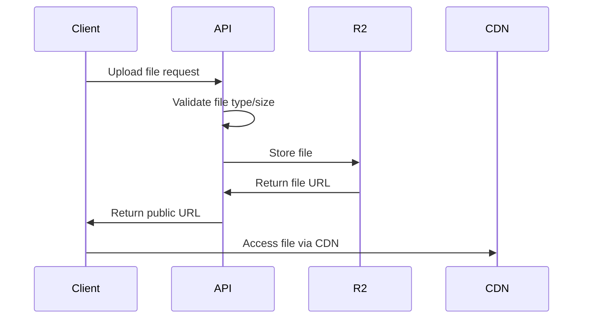
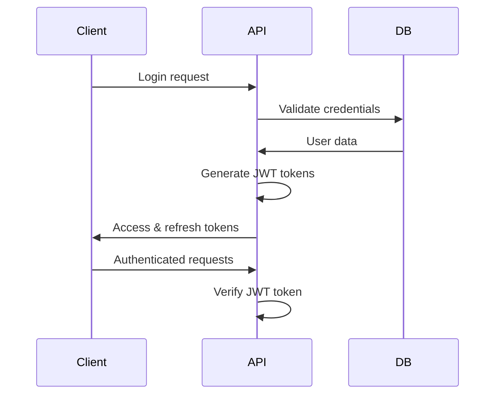
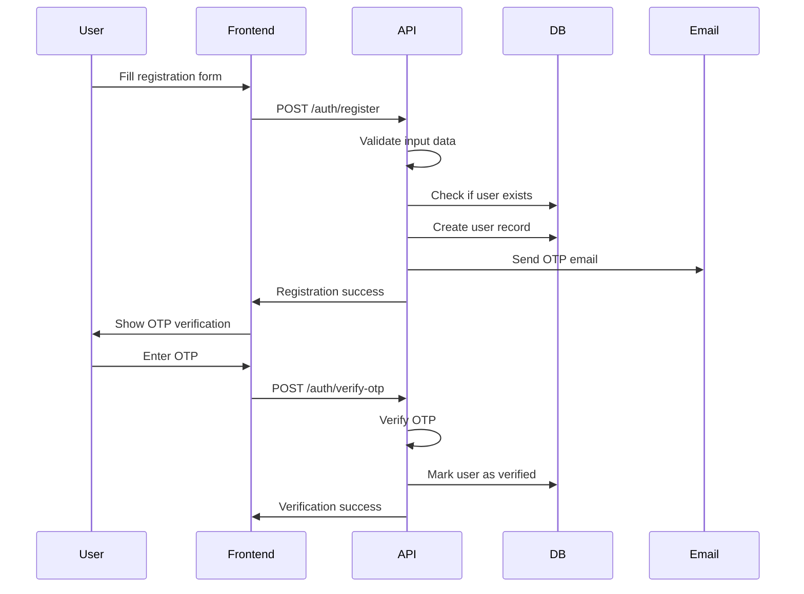
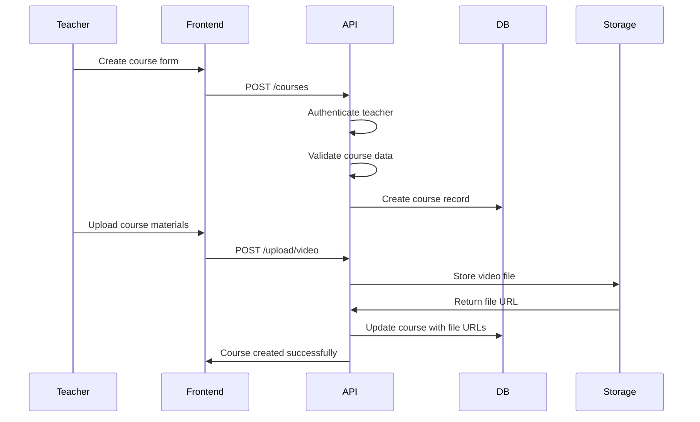
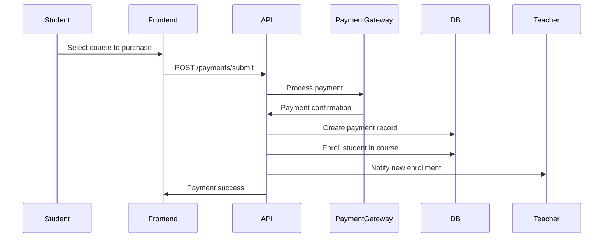

# Tizim Arxitekturasi - Dars Linker Platformasi

## Umumiy Ma'lumot

Dars Linker - zamonaviy, kengaytirilishi mumkin bo'lgan arxitektura bilan qurilgan keng qamrovli onlayn ta'lim platformasidir. Tizim ko'plab foydalanuvchi turlarini, kontent boshqaruvini, to'lov jarayonlarini va real-vaqt aloqasini yuqori ishlash va xavfsizlik standartlarini saqlab qolgan holda boshqarish uchun mo'ljallangan.

## High-Level Architecture

```mermaid
graph TB
    subgraph "Client Layer"
        FE[Frontend Application<br/>Vanilla JS + Vite]
        MOD[Moderator Panel<br/>Admin Interface]
        MOB[Mobile Browsers<br/>Responsive Design]
    end

    subgraph "API Gateway Layer"
        API[Express.js API Server<br/>RESTful Endpoints]
        AUTH[JWT Authentication<br/>Role-based Access]
        CORS[CORS Middleware<br/>Cross-origin Requests]
    end

    subgraph "Business Logic Layer"
        CTRL[Controllers<br/>Request Handlers]
        SVC[Services<br/>Business Logic]
        VAL[Validators<br/>Input Validation]
        MW[Middlewares<br/>Request Processing]
    end

    subgraph "Data Layer"
        DB[(MongoDB Atlas<br/>Primary Database)]
        CACHE[In-Memory Cache<br/>Performance Optimization]
        FILES[Cloudflare R2<br/>File Storage)]
    end

    subgraph "External Services"
        SMTP[Gmail SMTP<br/>Email Service]
        TG[Telegram API<br/>Bot Integration]
        PAY[Payment Gateways<br/>Click, Payme, Uzum]
    end

    subgraph "Infrastructure"
        RENDER[Render.com<br/>Backend Hosting]
        VERCEL[Vercel<br/>Frontend Hosting]
        CDN[Cloudflare CDN<br/>Content Delivery]
    end

    FE --> API
    MOD --> API
    MOB --> API
    
    API --> AUTH
    API --> CORS
    API --> CTRL
    
    CTRL --> SVC
    CTRL --> VAL
    CTRL --> MW
    
    SVC --> DB
    SVC --> CACHE
    SVC --> FILES
    SVC --> SMTP
    SVC --> TG
    SVC --> PAY
    
    API --> RENDER
    FE --> VERCEL
    MOD --> VERCEL
    FILES --> CDN
```

## Tizim Komponentlari

### 1. Frontend Dasturlari

#### Asosiy Frontend (Talaba/O'qituvchi Interfeysi)
- **Texnologiya**: Vite build vositasi bilan Vanilla JavaScript
- **Arxitektura**: Komponent asosidagi modulli dizayn
- **Marshrutlash**: History API bilan mijoz tomonidagi marshrutlash
- **Holat Boshqaruvi**: Oddiy holat boshqaruvi namunasi
- **Dizayn**: CSS o'zgaruvchilari va flexbox/grid bilan zamonaviy CSS
- **Build Jarayoni**: Tez ishlab chiqish va optimallashtirilgan ishlab chiqarish buildlari uchun Vite

**Key Features**:
- Responsive design for all device sizes
- Progressive Web App (PWA) capabilities
- Lazy loading for optimal performance
- Real-time updates via WebSocket connections
- Offline support for critical features

#### Moderator Panel (Admin Interface)
- **Technology**: Vanilla JavaScript with Vite
- **Purpose**: Content management and system administration
- **Authentication**: Separate admin authentication system
- **Features**: Blog management, user moderation, analytics dashboard

### 2. Backend API Server

#### Core Architecture
- **Framework**: Express.js 5.1.0 with ES modules
- **Runtime**: Node.js 18+ with modern JavaScript features
- **Architecture Pattern**: Layered architecture (Controller → Service → Model)
- **API Design**: RESTful API with consistent response format
- **Documentation**: Swagger/OpenAPI integration

#### Layer Breakdown

**Controller Layer**:
```javascript
// Handles HTTP requests and responses
export const getCourses = async (req, res) => {
  try {
    const courses = await courseService.getAllCourses(req.query);
    res.json({ success: true, data: courses });
  } catch (error) {
    res.status(500).json({ success: false, message: error.message });
  }
};
```

**Service Layer**:
```javascript
// Contains business logic
export const courseService = {
  async getAllCourses(filters) {
    const query = this.buildQuery(filters);
    return await Course.find(query).populate('teacher');
  }
};
```

**Model Layer**:
```javascript
// Database schemas and data access
const courseSchema = new mongoose.Schema({
  title: { type: String, required: true },
  teacher: { type: ObjectId, ref: 'Teacher' }
});
```

### 3. Database Architecture

#### MongoDB Atlas Configuration
- **Database**: MongoDB 7.0+ with replica set
- **Connection**: Mongoose ODM for schema management
- **Indexing**: Strategic indexes for query optimization
- **Backup**: Automated daily backups with point-in-time recovery

#### Schema Design

**User Hierarchy**:
```javascript
// Base User schema with discriminators
const userSchema = {
  firstName: String,
  lastName: String,
  email: { type: String, unique: true },
  phone: { type: String, unique: true },
  role: { type: String, enum: ['student', 'teacher', 'admin'] }
};

// Teacher extends User
const teacherSchema = {
  bio: String,
  specialization: String,
  courses: [{ type: ObjectId, ref: 'Course' }],
  balance: { type: Number, default: 0 }
};
```

**Content Structure**:
```javascript
// Course → Module → Lesson hierarchy
const courseSchema = {
  title: String,
  modules: [{ type: ObjectId, ref: 'Module' }],
  teacher: { type: ObjectId, ref: 'Teacher' }
};

const moduleSchema = {
  title: String,
  course: { type: ObjectId, ref: 'Course' },
  lessons: [{ type: ObjectId, ref: 'Lesson' }]
};
```

### 4. File Storage System

#### Cloudflare R2 Integration
- **Storage**: S3-compatible object storage
- **CDN**: Integrated content delivery network
- **Security**: Signed URLs for private content
- **Performance**: Global edge locations for fast access

**File Upload Flow**:


### 5. Authentication & Authorization

#### JWT-Based Authentication
- **Access Tokens**: Short-lived tokens (30 days)
- **Refresh Tokens**: Long-lived tokens (90 days)
- **Role-Based Access**: Student, Teacher, Admin roles
- **Security**: bcrypt password hashing, secure token storage

**Authentication Flow**:


### 6. External Service Integration

#### Telegram Bot System
- **Dual Bot Architecture**: Separate bots for students and teachers
- **Webhook vs Polling**: Configurable based on environment
- **Features**: Notifications, course updates, support chat

#### Email Service
- **Provider**: Gmail SMTP with app passwords
- **Use Cases**: OTP verification, notifications, marketing
- **Templates**: HTML email templates with responsive design

#### Payment Integration
- **Providers**: Click, Payme, Uzum Bank
- **Flow**: Manual verification system for security
- **Features**: Teacher payouts, transaction tracking

## Data Flow Architecture

### 1. User Registration Flow



### 2. Course Creation Flow



### 3. Payment Processing Flow



## Security Architecture

### 1. Authentication Security

**Multi-Layer Security**:
- Password hashing with bcrypt (10 rounds)
- JWT tokens with secure secrets
- OTP verification for sensitive operations
- Rate limiting on authentication endpoints

**Token Management**:
```javascript
// JWT token structure
{
  "userId": "user_id",
  "role": "teacher",
  "iat": 1640995200,
  "exp": 1643587200
}
```

### 2. API Security

**Request Validation**:
- Joi schema validation for all inputs
- File type and size validation
- SQL injection prevention
- XSS protection with input sanitization

**CORS Configuration**:
```javascript
const allowedOrigins = [
  'https://darslinker-azio.vercel.app',
  'https://darslinker-4n3z.vercel.app',
  'https://darslinker.uz',
  'https://moderator.darslinker.uz'
];
```

### 3. Data Security

**Database Security**:
- MongoDB Atlas with VPC peering
- Encrypted connections (TLS/SSL)
- Regular security updates
- Access control with IP whitelisting

**File Security**:
- Signed URLs for private content
- File type restrictions
- Virus scanning (planned)
- Access logging and monitoring

## Performance Architecture

### 1. Backend Performance

**Database Optimization**:
```javascript
// Strategic indexing
courseSchema.index({ teacher: 1, isPublished: 1 });
courseSchema.index({ title: 'text', description: 'text' });
userSchema.index({ email: 1 }, { unique: true });
```

**Caching Strategy**:
- In-memory caching for frequently accessed data
- Redis integration (planned for scaling)
- CDN caching for static assets
- Database query result caching

**Connection Pooling**:
```javascript
// MongoDB connection optimization
mongoose.connect(uri, {
  maxPoolSize: 10,
  serverSelectionTimeoutMS: 5000,
  socketTimeoutMS: 45000
});
```

### 2. Frontend Performance

**Build Optimization**:
- Vite for fast development and optimized builds
- Code splitting for reduced bundle sizes
- Tree shaking to eliminate unused code
- Asset optimization (images, fonts)

**Runtime Performance**:
- Lazy loading for images and components
- Virtual scrolling for large lists
- Debounced search and input handling
- Service worker for caching (planned)

### 3. CDN and Caching

**Cloudflare Integration**:
- Global CDN for static assets
- Edge caching for improved load times
- DDoS protection and security
- Analytics and monitoring

## Scalability Architecture

### 1. Horizontal Scaling

**Microservices Preparation**:
- Modular service architecture
- Database per service pattern (planned)
- API gateway for service routing
- Event-driven communication

**Load Balancing**:
- Render.com automatic scaling
- Database read replicas (planned)
- CDN for static content distribution
- Session-less architecture with JWT

### 2. Vertical Scaling

**Resource Optimization**:
- Efficient database queries
- Memory usage optimization
- CPU-intensive task optimization
- Background job processing

### 3. Monitoring and Observability

**Logging Strategy**:
```javascript
// Structured logging with Winston
logger.info('User action', {
  userId: user.id,
  action: 'course_purchase',
  courseId: course.id,
  timestamp: new Date().toISOString()
});
```

**Metrics Collection**:
- API response times
- Database query performance
- Error rates and types
- User engagement metrics

## Deployment Architecture

### 1. Infrastructure

**Backend Deployment (Render.com)**:
- Automatic deployments from Git
- Environment variable management
- Health checks and monitoring
- Automatic scaling based on load

**Frontend Deployment (Vercel)**:
- Edge deployment for global performance
- Automatic HTTPS and CDN
- Preview deployments for testing
- Analytics and performance monitoring

### 2. CI/CD Pipeline

**Automated Deployment**:
```yaml
# Deployment flow
Git Push → Build → Test → Deploy → Health Check
```

**Environment Management**:
- Development: Local development servers
- Staging: Preview deployments on Vercel/Render
- Production: Live deployment with monitoring

### 3. Backup and Recovery

**Data Backup**:
- MongoDB Atlas automated backups
- Point-in-time recovery capability
- File storage versioning
- Configuration backup

**Disaster Recovery**:
- Multi-region deployment (planned)
- Database failover mechanisms
- CDN redundancy
- Monitoring and alerting

## Future Architecture Considerations

### 1. Microservices Migration

**Service Decomposition**:
- User Service (authentication, profiles)
- Course Service (content management)
- Payment Service (transactions, billing)
- Notification Service (emails, push notifications)

### 2. Real-time Features

**WebSocket Integration**:
- Real-time chat between students and teachers
- Live course streaming
- Collaborative features
- Real-time notifications

### 3. Mobile Applications

**API-First Approach**:
- RESTful API ready for mobile consumption
- GraphQL layer for efficient data fetching
- Push notification infrastructure
- Offline synchronization capabilities

### 4. Advanced Analytics

**Data Pipeline**:
- Event streaming with Apache Kafka
- Data warehouse for analytics
- Machine learning for recommendations
- Business intelligence dashboards

---

This architecture document provides a comprehensive overview of the Dars Linker platform's technical foundation, designed for scalability, security, and maintainability while supporting the platform's educational mission.